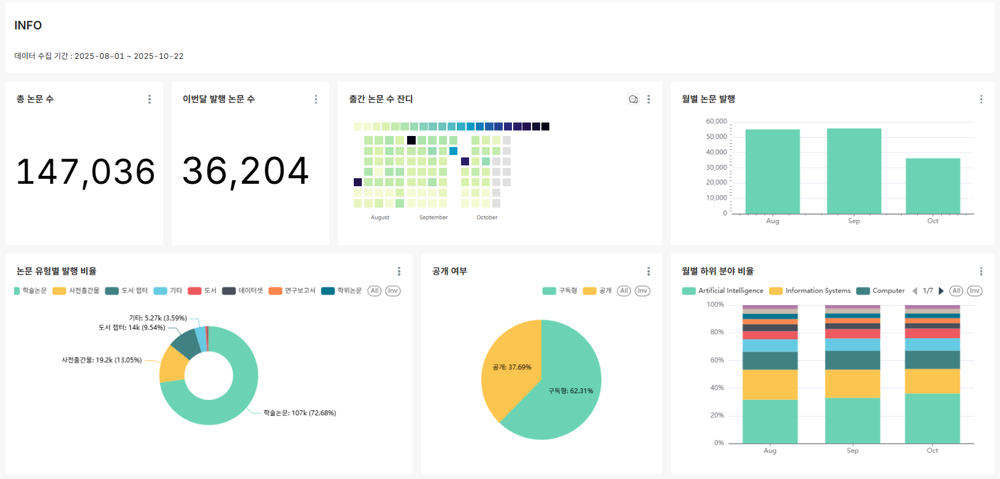
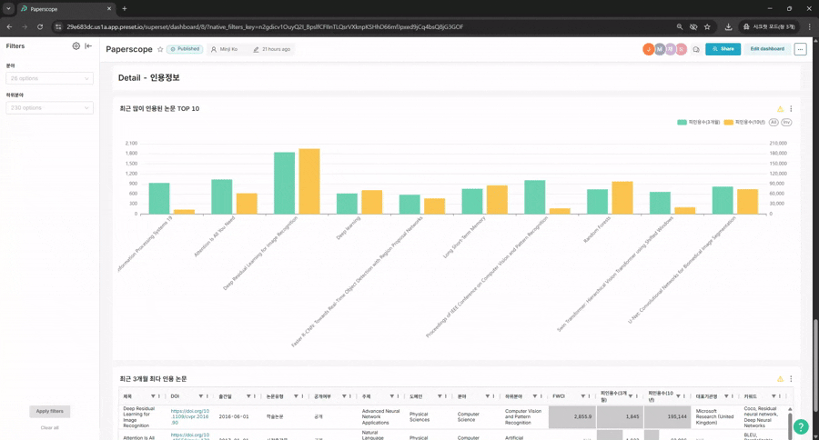

# 최신 논문 동향 분석 대시보드
- Computer Science 분야의 최근 출간 논문들에 대한 요약 정보와 트렌드 파악을 지원하는 통합 대시보드 플랫폼
--
## 🌵papescope 폴더구조
```
├─Analysis       # 전처리 코드 또는 분석용 테이블 생성 쿼리
├─Dashboard      # 대시보드
└─ETL            # raw data 추출, 변환 및 저장 코드
    ├─csv        # 추출된 csv 데이터
    ├─extract    # API 호출 코드
    └─transform  # json to csv 변환 코드
```
--

## 대시보드
[1. INFO](#info)<br>
[2. Details](#details-부분)<br>
[3. Details-인용정보](#details---인용정보-부분)<br>
### INFO

논문 발행의 전체적인 정보를 확인 할 수 있는 부분

- 논문 발행 추이: 일별·월별 발행 논문 수를 Big Number, 잔디 차트(Heatmap), Bar 차트를 통해 시각화하여 연구 활동의 전반적인 흐름을 한눈에 파악
- 논문 유형 비율: 발행 논문의 유형별 비중을 Pie 차트로 표현하여 각 유형의 분포를 시각적으로 확인
- 공개 여부 분석: 논문의 공개·비공개 현황을 Pie 차트로 시각화하여 오픈액세스 비율을 분석
- 하위 분야 동향: 월별 하위 분야별 논문 수를 Stacked Bar 차트로 표현하여 분야별 증감 추이를 비교 및 분석


### Details 부분

상세 대시보드
: 필터 기능을 통해 사용자가 원하는 분야 및 하위 분야별 연구 현황을 선택적으로 조회할 수 있도록 구성

- 대표 주제별 논문 수: Bar 차트를 통해 주제별 논문 발행 현황을 시각적으로 확인
- 급상승·감소 연구 토픽:  수평 Bar 차트로 전월 대비 연구 주제의 증감률을 분석
- 인기 주제 및 키워드: WordCloud를 활용해 주요 논문 주제와 키워드를 시각화
- 저자별 피인용 분석: Stacked Bar 차트를 통해 저자별 논문 수 대비 피인용 비율 확인
- 기관·국가별 연구 분포: 지도(Map)와 트리맵을 연동해 국가 및 기관별 논문 발행 현황을 파악


### Details - 인용정보 부분

상세 대시보드 - 인용정보

- 최근 인용 상위 논문 TOP10: Bar 차트를 통해 최근 3개월 및 10년간 인용 횟수가 높은 논문을 시각적으로 확인
- 최근 3개월 최다 인용 논문: Interactive Table을 활용하여 분야별 필터링 및 세부 조회 가능